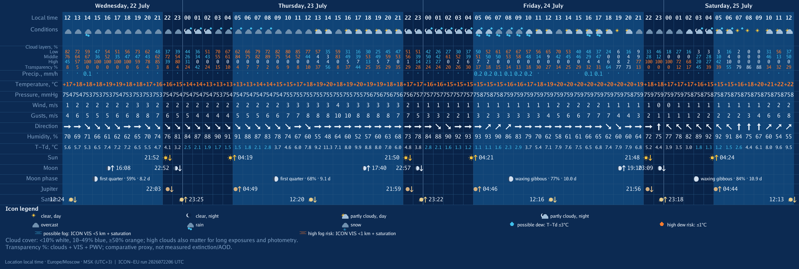
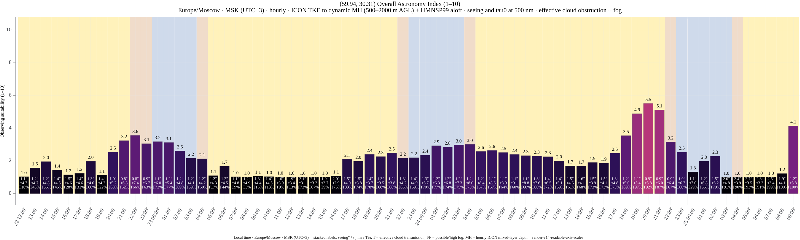
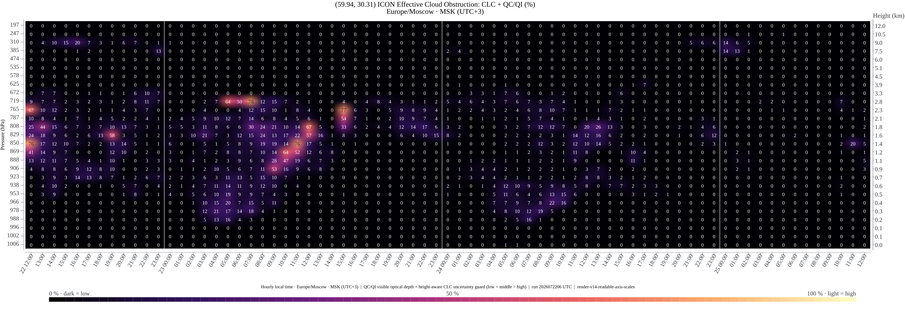
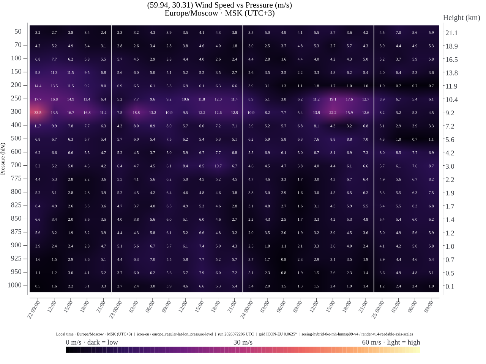
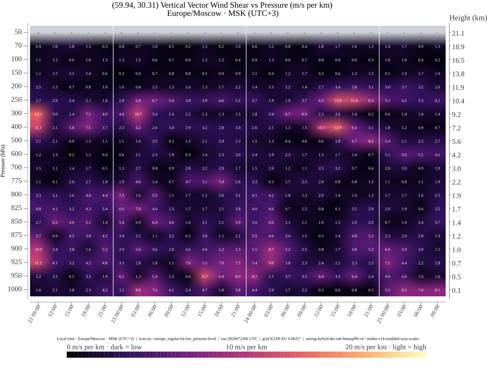
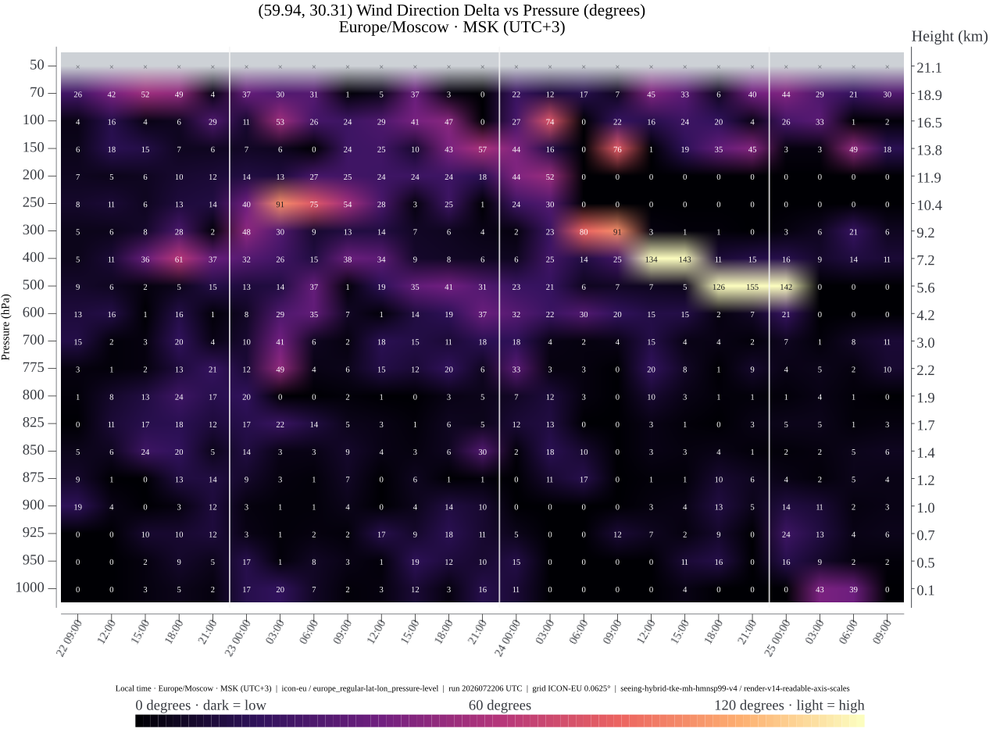
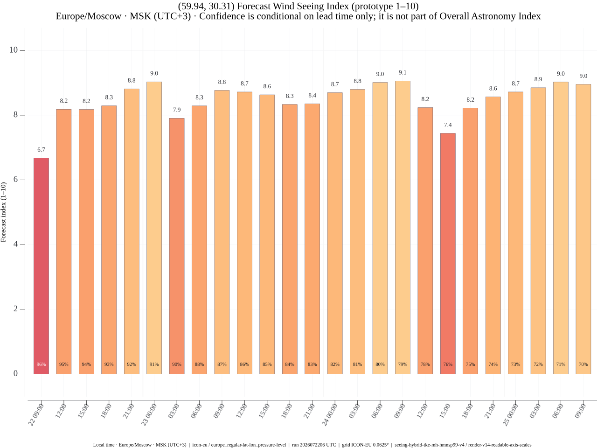

# bot_astrosferum


Research-oriented Go bot for astronomy-condition forecasts.

**[Русская версия README](README.ru.md)**

`bot_astrosferum` combines DWD ICON-EU and ICON Global weather fields, model-derived optical turbulence, effective cloud obstruction, fog, wind diagnostics, and ephemerides into hourly planning charts. ICON-EU is selected inside its European domain, while ICON Global provides worldwide fallback coverage outside it. It is scientific software, but not a calibrated measuring instrument: seeing and the Overall Astronomy Index remain model estimates until validated against observations. See [Scientific status and reproducibility](docs/scientific-method.en.md).

## Saint Petersburg example

The images below are real English-language output for Saint Petersburg from ICON-EU run `2026072206 UTC`. They are a dated reproducibility snapshot, not a current forecast. The hero above is illustrative artwork and does not encode measurements.

### 1/7 · Hourly weather and astronomical events



### 2/7 · Overall Astronomy Index



Use this combined hourly score to shortlist the most promising observing windows: it brings modeled seeing, coherence time, cloud obstruction, and fog into one ranking. It is a planning estimate rather than a measurement, so inspect the following diagnostic charts before committing to a session.

### 3/7 · Effective cloud obstruction by height



This chart shows when and at what altitude optically significant cloud is expected. It helps distinguish dense low cloud from less obstructive high cloud and assess whether imaging, photometry, or an unobstructed target altitude is plausible.

### 4/7 · Wind speed by pressure and height



The vertical wind profile exposes strong-flow layers and the jet stream. These can signal degraded image stability or tracking conditions, although wind speed alone is not a direct seeing measurement.

### 5/7 · Vertical vector wind shear



Vector shear measures how quickly the full wind vector changes per kilometre. Bright layers identify likely turbulence-producing boundaries and hours when fine-detail planetary or long-focal-length imaging may be less stable.

### 6/7 · Wind-direction change between adjacent levels



This diagnostic highlights turning between adjacent atmospheric levels. Read it together with wind speed and vector shear: a large turn in near-calm air matters much less than the same change in a strong flow.

### 7/7 · Forecast Wind Seeing Index



This compact index ranks hours using the modeled wind profile only. It is useful for comparing atmospheric stability, while the Overall Astronomy Index remains the final planning view because this chart deliberately excludes cloud and fog.

Telegram and VK support native location sharing, textual coordinates, up to 10 PostgreSQL-backed saved points per user, and administrator usage reports. Both adapters use the same command, forecast, rendering, and persistence handler, so their calculated results are equivalent. PostgreSQL files, ICON runs, render caches, and light-pollution atlases live below `./data` and are excluded from Git.

- [Архитектура на русском](docs/architecture.ru.md)
- [Architecture in English](docs/architecture.en.md)
- [Научная методика, формулы и воспроизводимость](docs/scientific-method.ru.md)
- [Scientific method, formulas, and reproducibility](docs/scientific-method.en.md)
- [Текущий статус реализации](docs/implementation-status.ru.md)
- [Current implementation status](docs/implementation-status.en.md)
- [Privacy notice](PRIVACY.md)
- [Contributing](CONTRIBUTING.md)
- [Security policy](SECURITY.md)

## System requirements

The following profile is for one production instance with both ICON-EU and
ICON Global enabled and the repository defaults. Development builds and the
synthetic `render-sample` command need substantially fewer resources.

| Resource | Minimum | Recommended |
|---|---:|---:|
| CPU | 4 x86-64 cores | 8–12 x86-64 cores |
| RAM | 32 GiB | 48–64 GiB |
| Free SSD space | 200 GiB | 300 GiB or more on NVMe |
| Software | 64-bit Linux, Docker Engine, Docker Compose v2 | Current stable Docker on a supported Linux distribution |

The default in-memory point-cache budget is `20 GiB` and the container uses
`GOMEMLIMIT=24GiB`; lower-memory installations must reduce
`app.point_cache_memory_limit`. Model synchronization refuses to start below
the configured `sync.min_free_space` threshold, which defaults to `150 GiB`.
The extra disk headroom is required for atomic downloads, two retained model
runs, PostgreSQL, point/render caches, and light-pollution tiles. Outbound DNS
and HTTPS access to DWD, Telegram, VK, and the configured atlas sources is
required; neither platform's long polling needs an inbound application port.

The repository contains no model runs or credentials. Runtime data and bind mounts live only below `/opt/docker/bot_astrosferum` on the production host.

Platform tokens are separate ignored files: `secrets/telegram_token` and
`secrets/vk_token`, both mode `0600`. Enabling VK also requires the numeric
community `group_id` under `platforms.vk` in `config/config.yaml`; optional VK
administrator IDs are supplied through `ASTRO_VK_ADMIN_IDS`.

Useful commands on the target host:

```sh
cd /opt/docker/bot_astrosferum
docker compose up -d --build
docker compose logs -f bot_astrosferum
docker compose run --rm bot_astrosferum doctor --config /app/config/config.yaml
docker compose run --rm bot_astrosferum render-sample --output /app/data/verification/render-sample
docker compose run --rm bot_astrosferum sync-icon-eu --config /app/config/config.yaml
docker compose run --rm bot_astrosferum render-point --config /app/config/config.yaml --lat 59.9386 --lon 30.3141
docker compose run --rm bot_astrosferum light-pollution --lat 55.7558 --lon 37.6173
```

`/start` in Telegram or VK explains coordinate input and the charts. Native Telegram locations, VK geo attachments, plain `latitude, longitude` text, and `/forecast latitude longitude` are accepted. The adapters use independent long-polling supervisors: a temporary outage of one platform does not stop the other. Points inside the ICON-EU domain use ICON-EU; every other world coordinate uses the latest complete DWD ICON Global run. Both routes provide the same seven chart types, including native model-level cloud obstruction and lower-atmosphere TKE. DWD publishes Global TKE only through `+48 h`, so its hybrid Overall chart honestly ends there while weather, cloud obstruction, and pressure-level diagnostics continue through the main horizon. Global also lacks the direct `VIS` field used for fog diagnosis and the transparency proxy.

Forecast coverage is worldwide. ICON-EU covers the configured regular-grid bounding box `29.5…70.5° N, 23.5° W…62.5° E`, approximately `27.4 million km²` on a spherical Earth (land and sea, not a land-area figure). ICON Global covers the complete globe, approximately `510.1 million km²`, including both poles and the date line; it is not cropped to Russia.

The audited Overall design combines native ICON `T/P/TKE/HHL` turbulence from the surface to the hourly ICON `MH` mixed-layer depth (clamped to `500…2000 m AGL`), HMNSP99 above it, and wind-weighted coherence time `tau0`. It also uses phase-resolved `TQC/TQI` cloud optics with conservative tier-aware diagnostic-`CLC` guards, possible/high fog, and a deliberately mild surface-wind factor. Dew and light pollution are not penalties. Vector shear already contains wind-direction changes, so Overall does not apply a duplicate direction penalty. This `1…10` result is an auditable engineering mapping, not measured seeing or a universal scientific scale; see the implementation-status documents for whether the revised model bundle has reached production.

The cloud heatmap uses `CLC/QC/QI/T` and native `HHL` thickness at 27 model levels; layer air mass is `P/(Rd*T)*dz`. Its low/middle/high unresolved-cloud guards are `45%/24.75%/8.1%` of diagnosed cover—conservative uncertainty bounds, not physical opacity—and resolved condensate always wins when stronger. Overall shares that optical-depth kernel and guard policy but uses total-column fields plus random overlap of the three aggregated tiers, so its transmission and individual heatmap cells are not expected to be identical. ICON-EU contracts are `surface-hourly-v17`, `cloud-hourly-v4`, and `point-v6-native-cloud-mass-mh`; ICON Global uses `cloud-hourly-v1` and `point-v2-native-cloud`. ICON Global cloud bundles contain the same 187 messages/hour through `+48 h`, then 169 messages/hour because DWD stops publishing TKE while continuing every cloud and wind field. The response also reports coordinate-interpolated LPI, modeled zenith SQM, and an explicitly approximate Bortle reference from the pinned Light Pollution Atlas 2024. Weather includes flow arrows, direct-VIS fog risk where the selected provider publishes visibility, dew advice, and minute-level Sun, Moon, Jupiter, and Saturn events. Synthetic fixture data are never sent to users. The serving process atomically publishes validated upper-air, surface, and cloud bundles below the selected provider's `current`; user requests only read the last complete publication.
