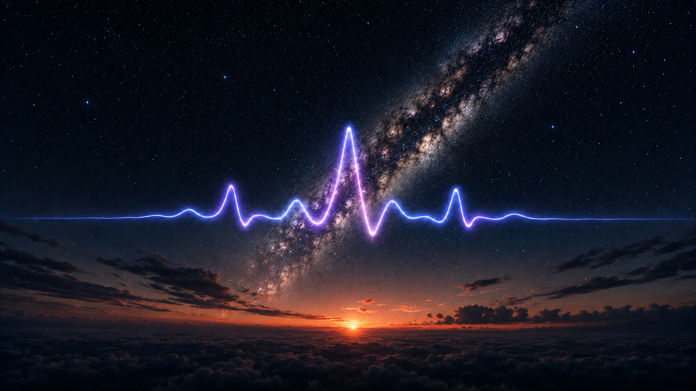
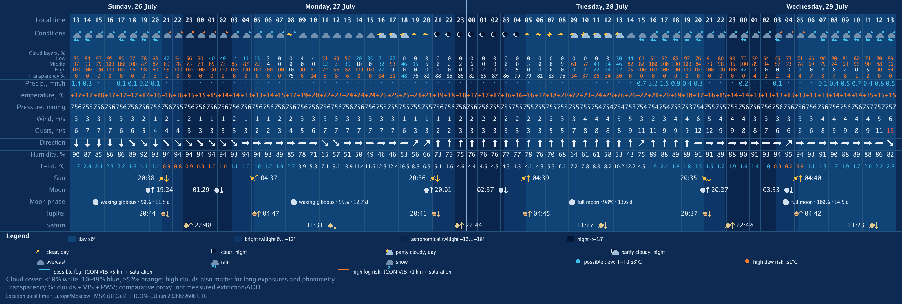
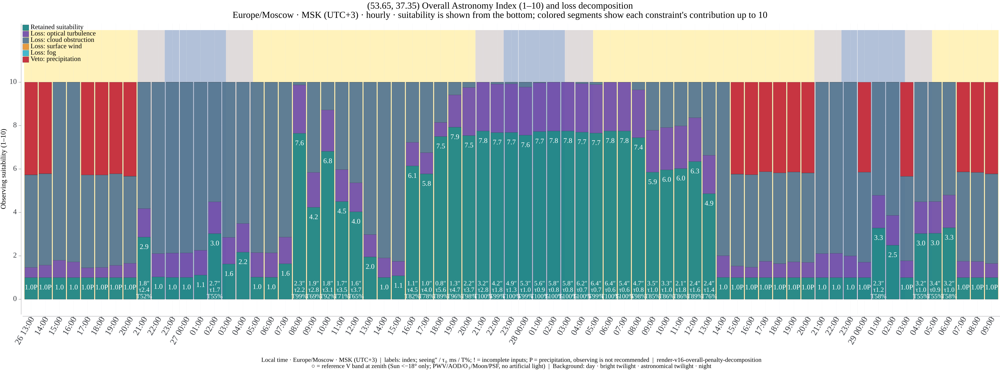
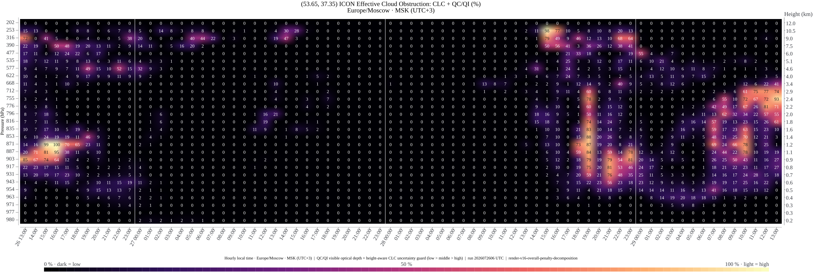
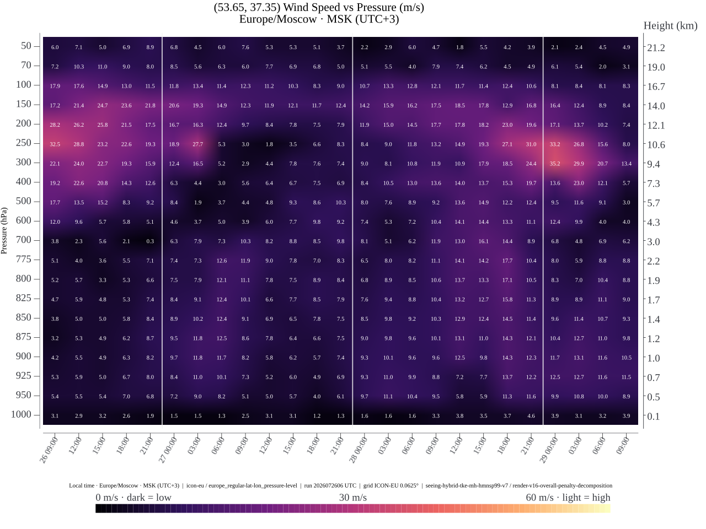
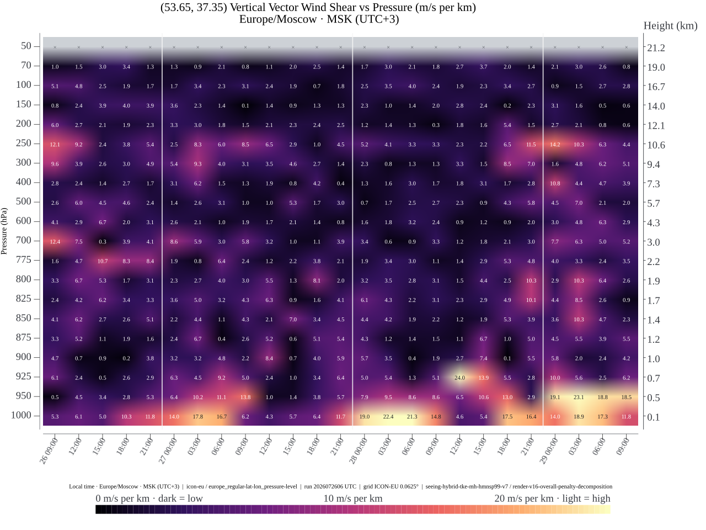
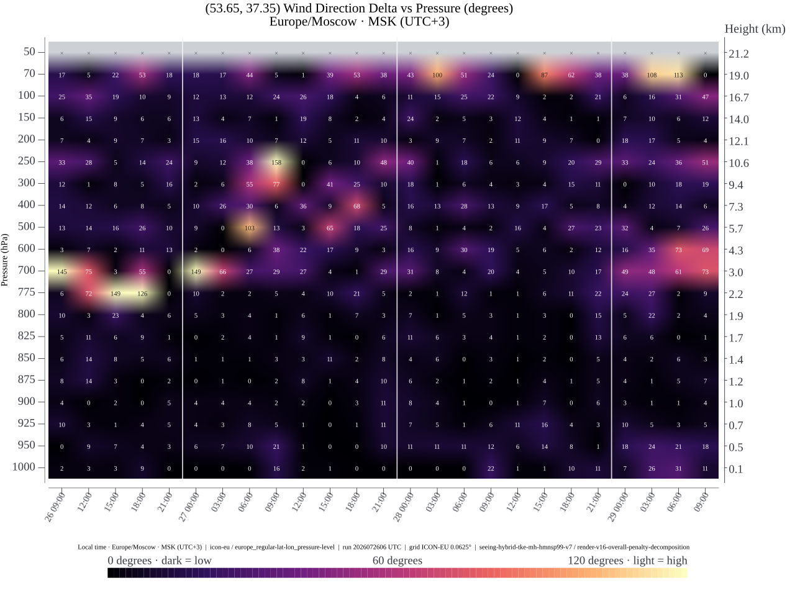
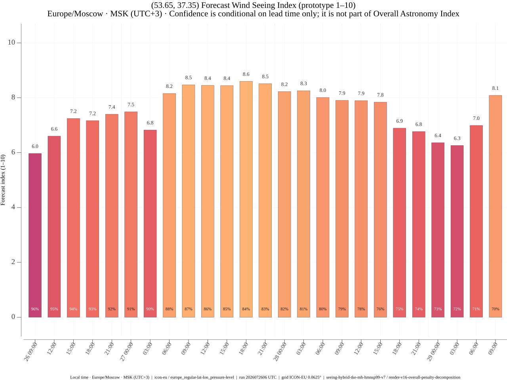
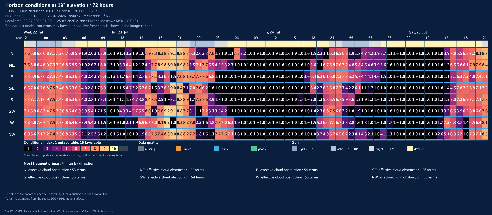

# bot_astrosferum



Research-oriented Go bot for astronomy-condition forecasts.

**[Русская версия README](README.ru.md)**

`bot_astrosferum` combines DWD ICON-EU and ICON Global weather fields, model-derived optical turbulence, effective cloud obstruction, fog, wind diagnostics, and ephemerides into hourly planning charts. ICON-EU is selected inside its European domain, while ICON Global provides worldwide fallback coverage outside it. It is scientific software, but not a calibrated measuring instrument: seeing and the Overall Astronomy Index remain model estimates until validated against observations. See [Scientific status and reproducibility](docs/scientific-method.en.md).

## Plavsk example

The images below are real English-language output for Plavsk from ICON-EU run `2026072218 UTC`. They are a dated reproducibility snapshot, not a current forecast. The hero above is illustrative artwork and does not encode measurements.

### 1/7 · Hourly weather and astronomical events



### 2/7 · Overall Astronomy Index



Use the lower part of each enlarged column as the retained suitability. Colored segments above it are an exact Shapley decomposition of losses from optical turbulence, cloud obstruction, surface wind, fog, and precipitation, and close the column at 10. Detected precipitation is a red operational veto and forces the index to 1. During astronomical night, a ring can additionally show the separate zenith Reference V-band efficiency using ICON PWV, NASA GEOS-CF AOD/ozone, lunar background, and the atmospheric PSF; it excludes artificial light and never silently changes the generic Overall value.

### 3/7 · Effective cloud obstruction by height



This chart shows when and at what altitude optically significant cloud is expected. It helps distinguish dense low cloud from less obstructive high cloud and assess whether imaging, photometry, or an unobstructed target altitude is plausible.

### 4/7 · Wind speed by pressure and height



The vertical wind profile exposes strong-flow layers and the jet stream. These can signal degraded image stability or tracking conditions, although wind speed alone is not a direct seeing measurement.

### 5/7 · Vertical vector wind shear



Vector shear measures how quickly the full wind vector changes per kilometre. Bright layers identify likely turbulence-producing boundaries and hours when fine-detail planetary or long-focal-length imaging may be less stable.

### 6/7 · Wind-direction change between adjacent levels



This diagnostic highlights turning between adjacent atmospheric levels. Read it together with wind speed and vector shear: a large turn in near-calm air matters much less than the same change in a strong flow.

### 7/7 · Forecast Wind Seeing Index



This compact index ranks hours using the modeled wind profile only. It is useful for comparing atmospheric stability, while the Overall Astronomy Index remains the final planning view because this chart deliberately excludes cloud and fog.

### Horizon · Eight directional conditions at 10° elevation



This separate ICON-EU analysis compares N, NE, E, SE, S, SW, W, and NW for all 73 hourly terms. Read it as a coarse low-altitude planning map: it combines line-of-sight cloud obstruction, fog, model terrain, and optical turbulence, while the named limiting factor explains what controls each poor interval.

Telegram and VK support native location sharing, textual coordinates, up to 10 PostgreSQL-backed saved points per user, and administrator usage reports aggregated across both platforms. Both adapters use the same command, forecast, rendering, and persistence handler, so their calculated results are equivalent. PostgreSQL files, ICON runs, render caches, and light-pollution atlases live below `./data` and are excluded from Git.

The bot also provides an optional ICON-EU-only Horizon analysis. When enabled,
it appears as a second-stage action after an ordinary ICON-EU forecast and
renders all 73 hourly terms `f000..f072` as one eight-direction heatmap at a
fixed `10°` geometric elevation. It uses coarse ICON HHL terrain, shares the
Overall calibration, and never exposes a Horizon button or job for ICON Global.
The current run is checked before costly work, after acquisition, and
immediately before each send, including cache hits. See
[Current implementation status](docs/implementation-status.en.md) for the
implemented contract and operational validation gates.

The bilingual website is maintained independently in
[site-astrosferum](https://github.com/Haeniken/site-astrosferum). This repository
owns the scientific Astrodome calculation, queues, caches, and an authenticated
internal account API; it does not contain OIDC, browser UI, web sessions, site
preferences, or the public deployment. The dependency is one-way: the site may
call the bot API, while Telegram/VK forecasts, PostgreSQL, model synchronization,
Horizon, and Astrodome calculation continue to work when the site is absent.

Astrodome renders up to 72 native hourly directional datasets from the explicit
`10°` calculation boundary to one azimuth-independent zenith node. Every
direction is computed from interpolated native ICON-EU primitives followed by a
complete physical recalculation; finished seeing, `tau0`, cloud transmission,
Overall, and data quality are never interpolated. The current production writer
is production-v2/v29/v23. See [Architecture](docs/architecture.en.md), the
[scientific method](docs/scientific-method.en.md), and the separate
[site repository](https://github.com/Haeniken/site-astrosferum).

- [Архитектура на русском](docs/architecture.ru.md)
- [Architecture in English](docs/architecture.en.md)
- [Научная методика, формулы и воспроизводимость](docs/scientific-method.ru.md)
- [Scientific method, formulas, and reproducibility](docs/scientific-method.en.md)
- [Текущий статус реализации](docs/implementation-status.ru.md)
- [Current implementation status](docs/implementation-status.en.md)
- [Configuration reference](docs/configuration.en.md)
- [Independent website and deployment](https://github.com/Haeniken/site-astrosferum)
- [Privacy notice](PRIVACY.md)
- [Contributing](CONTRIBUTING.md)
- [Security policy](SECURITY.md)

## System requirements

The following profile is for one production instance with both ICON-EU and
ICON Global enabled and the repository defaults. Development builds and the
synthetic `render-sample` command need substantially fewer resources.

| Resource | Minimum | Recommended |
|---|---:|---:|
| CPU | 4 x86-64 cores | 8–12 x86-64 cores |
| RAM | 32 GiB | 48–64 GiB |
| Free SSD space | 300 GiB | 550 GiB or more on NVMe |
| Software | 64-bit Linux, Docker Engine, Docker Compose v2 | Current stable Docker on a supported Linux distribution |

Building the production image requires outbound HTTPS access to GHCR, Docker
Hub, the Ubuntu package repositories, and the Trivy vulnerability database.
The build applies the currently available Ubuntu security updates and removes
the unused `pebble` helper inherited from the GDAL base image. Allow at least
`15 GiB` of additional temporary Docker space while rebuilding and scanning.

Source development and the required pre-push checks use Go `1.26.5`,
`golangci-lint 2.12.2`, and `govulncheck 1.6.0`. CI additionally builds the
production image and rejects `CRITICAL` or `HIGH` Trivy findings; it does not
produce a separate `MEDIUM`/`LOW` report.

The default in-memory point-cache budget is `20 GiB` and the container uses
`GOMEMLIMIT=24GiB`; lower-memory installations must reduce
`app.point_cache_memory_limit`. Model synchronization refuses to start below
the configured `sync.min_free_space` threshold, which defaults to `150 GiB`.
The extra disk headroom is required for atomic downloads, two retained model
runs, PostgreSQL, point/render caches, and light-pollution tiles. Outbound DNS
and HTTPS access to DWD, NASA GEOS-CF, Telegram, VK, and the configured atlas sources is
required; neither platform's long polling needs an inbound application port.

The optional Astrodome deployment adds an isolated directional worker shared
with Horizon. The initial, deliberately conservative candidate gives that
worker four CPUs, a `24 GB` cgroup hard limit, and `GOMEMLIMIT=12GiB`. It also
enforces a `400 GiB` project-footprint ceiling and a `150 GiB` free-space
reserve before dome admission. These are rollout guardrails, not measured
minimum requirements: do not reduce them or publish a smaller production
profile until cold/warm full-dome, concurrent model-sync, memory-pressure, and
ordinary-forecast latency benchmarks pass. The shared active-slot limit is
`ASTRO_DIRECTIONAL_CONCURRENCY=1` by default; increasing it can multiply the
full-dome resident footprint and requires repeating those resource tests. The
optional website is deployed from the independent `site-astrosferum`
repository and does not download or retain another ICON model store.

The repository contains no model runs or credentials. Bot runtime data,
PostgreSQL, and bind mounts live below `/opt/docker/bot-astrosferum`. The
independent website uses `/opt/docker/site-astrosferum` and may be stopped or
removed without disabling the bot.

Platform tokens are separate ignored files: `secrets/telegram_token` and
`secrets/vk_token`, both mode `0600`. Enabling VK also requires the numeric
community `group_id` under `platforms.vk` in `config/config.yaml`; optional VK
administrator IDs are supplied through `ASTRO_VK_ADMIN_IDS`.

Only `POSTGRES_PASSWORD` is required in `.env`; the remaining variables are
optional feature, calibration, or access settings. See the
[complete configuration reference](docs/configuration.en.md) for environment
and YAML effects and recommended values.

Useful commands on the target host:

```sh
cd /opt/docker/bot-astrosferum
docker compose up -d --build
docker compose logs -f bot_astrosferum
docker compose run --rm bot_astrosferum doctor --config /app/config/config.yaml
docker compose run --rm bot_astrosferum render-sample --output /app/data/verification/render-sample
docker compose run --rm bot_astrosferum sync-icon-eu --config /app/config/config.yaml
docker compose run --rm bot_astrosferum render-point --config /app/config/config.yaml --lat 59.9386 --lon 30.3141
docker compose run --rm bot_astrosferum render-horizon --config /app/config/config.yaml --lat 59.9386 --lon 30.3141 --language en --output /app/data/verification/horizon-live.png
docker compose run --rm bot_astrosferum light-pollution --lat 55.7558 --lon 37.6173
```

`render-horizon` is an operational verification command. It requires Horizon
to be enabled and a complete current ICON-EU run whose full directional
footprint is supported; end-user availability additionally depends on the
enabled platform adapter and action path. It waits on the same process-shared
execution lease as the directional worker and therefore cannot overlap a
Horizon or Astrodome job.

`/start` in Telegram or VK explains coordinate input and the charts. Native Telegram locations, VK geo attachments, plain `latitude, longitude` text, and `/forecast latitude longitude` are accepted. The adapters use independent long-polling supervisors: a temporary outage of one platform does not stop the other. Points inside the ICON-EU domain use ICON-EU; every other world coordinate uses the latest complete DWD ICON Global run. Both routes provide the same seven chart types, including native model-level cloud obstruction and lower-atmosphere TKE. DWD publishes Global TKE only through `+48 h`, so its hybrid Overall chart honestly ends there while weather, cloud obstruction, and pressure-level diagnostics continue through the main horizon. Global also lacks the direct `VIS` field used for fog diagnosis and the transparency proxy.

Forecast coverage is worldwide. ICON-EU covers the configured regular-grid bounding box `29.5…70.5° N, 23.5° W…62.5° E`, approximately `27.4 million km²` on a spherical Earth (land and sea, not a land-area figure). ICON Global covers the complete globe, approximately `510.1 million km²`, including both poles and the date line; it is not cropped to Russia.

The audited Overall design combines native ICON `T/P/TKE/HHL` turbulence from the surface to the hourly ICON `MH` mixed-layer depth (clamped to `500…2000 m AGL`), HMNSP99 above it, and wind-weighted coherence time `tau0`. It also uses phase-resolved `TQC/TQI` cloud optics with conservative tier-aware diagnostic-`CLC` guards, possible/high fog, a deliberately mild surface-wind factor, and a binary precipitation veto at the configurable deterministic detection threshold. Dew and light pollution are not penalties. Vector shear already contains wind-direction changes, so Overall does not apply a duplicate direction penalty. Physical seeing and `tau0` remain fully reported, while their combined target-agnostic utility penalty is capped at 25%: turbulence blurs fine detail, whereas cloud, fog, or precipitation can prevent useful operation. The stacked colors allocate the exact multiplicative loss with an order-independent Shapley decomposition; they are explanations of the existing score rather than new penalties.

Alongside that generic score, an explicitly separate Johnson-V zenith reference evaluates background-limited point-source efficiency during astronomical night. ICON supplies PWV and actual model-surface pressure reconstructed from the co-located lowest native `P/T` level and `HHL` geometry; mean-sea-level `PMSL` remains a weather field and is never used by SPECTRL2. NASA GEOS-CF supplies independently initialized AOD at 550 nm and total ozone, SPECTRL2 supplies the pinned clear-air spectral approximation, and the lunar term uses hourly topocentric geometry with a declared Krisciunas-Schaefer fallback. Missing pressure inputs or missing/stale composition are fail-open: the ring is omitted, input completeness is reported, and the ICON forecast remains available. The code also exposes target-conditioned airmass/wavelength seeing and Gaussian-equivalent delivered-IQ helpers, but does not insert a target-specific quantity into an anonymous location-only Overall score. This `1…10` result remains an auditable engineering mapping, not measured seeing or a universal scientific scale; see the scientific-method and implementation-status documents for the exact formulas and validation limits.

The cloud heatmap uses `CLC/QC/QI/T` and native `HHL` thickness at 27 model levels; layer air mass is `P/(Rd*T)*dz`. Its low/middle/high unresolved-cloud guards are `45%/24.75%/8.1%` of diagnosed cover—conservative uncertainty bounds, not physical opacity—and resolved condensate always wins when stronger. Overall shares that optical-depth kernel and guard policy but uses total-column fields plus random overlap of the three aggregated tiers, so its transmission and individual heatmap cells are not expected to be identical. ICON-EU contracts are `surface-hourly-v17`, `cloud-hourly-v4`, and `point-v6-native-cloud-mass-mh`; ICON Global uses `cloud-hourly-v1` and `point-v2-native-cloud`. ICON Global cloud bundles contain the same 187 messages/hour through `+48 h`, then 169 messages/hour because DWD stops publishing TKE while continuing every cloud and wind field. The response also reports coordinate-interpolated LPI, modeled zenith SQM, and an explicitly approximate Bortle reference from the pinned Light Pollution Atlas 2024. Weather includes flow arrows, direct-VIS fog risk where the selected provider publishes visibility, dew advice, and minute-level events for the Sun, Moon, Mercury, Venus, Mars, Jupiter, Saturn, Uranus, Neptune, and Pluto. The interactive site uses the same versioned hourly topocentric positions for exact altitude cells and Astrodome sky paths; shortest-arc interpolation only smooths the dashed line between stored hours. Synthetic fixture data are never sent to users. The serving process atomically publishes validated upper-air, surface, and cloud bundles below the selected provider's `current`; user requests only read the last complete publication.
