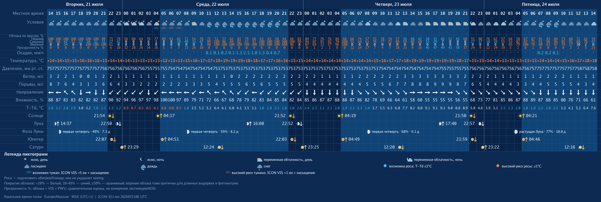
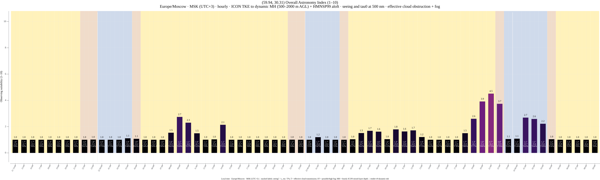
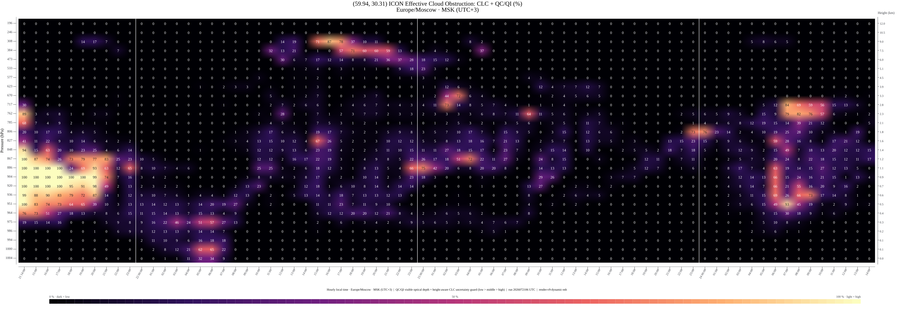
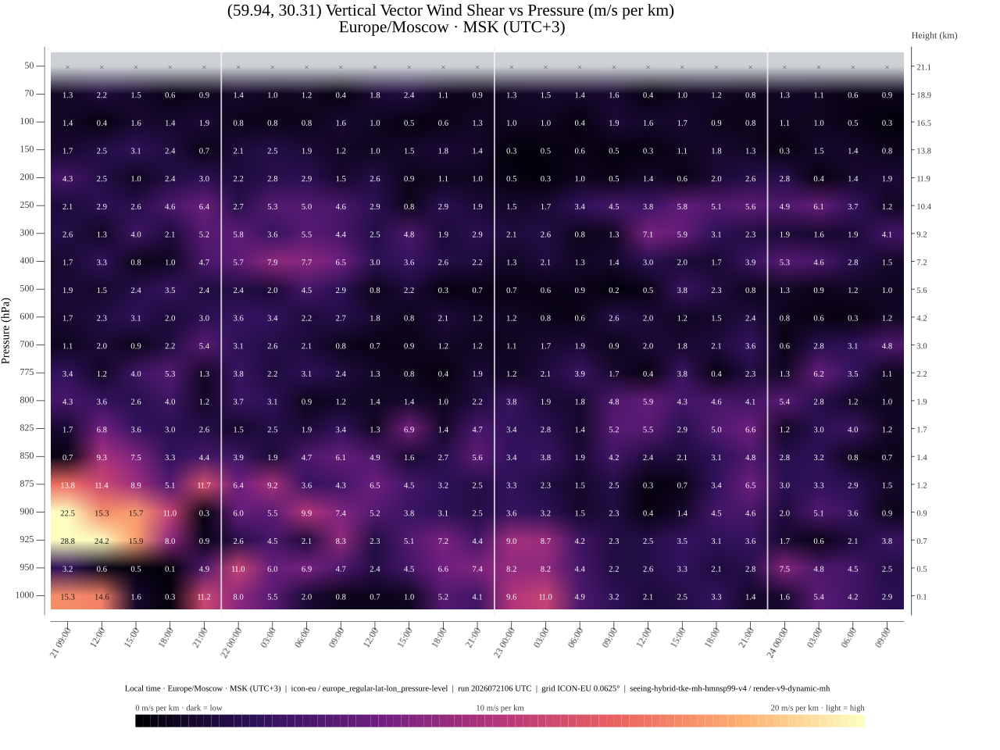

# bot_astrosferum


Research-oriented Go bot for astronomy-condition forecasts in Telegram and VK.

**[Русская версия README](README.ru.md)**

`bot_astrosferum` combines ICON-EU weather fields, model-derived optical turbulence, effective cloud obstruction, fog, wind diagnostics, and ephemerides into hourly planning charts. It is scientific software, but not a calibrated measuring instrument: seeing and the Overall Astronomy Index remain model estimates until validated against observations. See [Scientific status and reproducibility](docs/scientific-method.en.md).

## Saint Petersburg example

The images below are real output for Saint Petersburg from ICON-EU run `2026072106 UTC`. They are a dated reproducibility snapshot, not a current forecast. The hero above is illustrative artwork and does not encode measurements.

### Hourly weather and astronomical events



### Overall Astronomy Index



### Effective cloud obstruction by height



### Vertical vector wind shear



Telegram supports native and textual coordinates, up to 10 PostgreSQL-backed saved points per user, and administrator usage reports. PostgreSQL files, ICON runs, render caches, and light-pollution atlases live below `./data` and are excluded from Git.

- [Архитектура на русском](docs/architecture.ru.md)
- [Architecture in English](docs/architecture.en.md)
- [Перепроверка Overall Astronomy Index](docs/research-overall-index.ru.md)
- [Overall Astronomy Index re-evaluation](docs/research-overall-index.en.md)
- [Текущий статус реализации](docs/implementation-status.ru.md)
- [Current implementation status](docs/implementation-status.en.md)
- [Scientific status and reproducibility](docs/scientific-method.en.md)
- [Privacy notice](PRIVACY.md)
- [Contributing](CONTRIBUTING.md)
- [Security policy](SECURITY.md)

The repository contains no model runs or credentials. Runtime data and bind mounts live only below `/opt/docker/bot_astrosferum` on the production host.

Useful commands on the target host:

```sh
cd /opt/docker/bot_astrosferum
docker compose up -d --build
docker compose logs -f bot_astrosferum
docker compose run --rm bot_astrosferum doctor --config /app/config/config.yaml
docker compose run --rm bot_astrosferum render-sample --output /app/data/verification/render-sample
docker compose run --rm bot_astrosferum sync-icon-eu --config /app/config/config.yaml
docker compose run --rm bot_astrosferum render-point --config /app/config/config.yaml --lat 59.9386 --lon 30.3141
docker compose run --rm bot_astrosferum light-pollution --lat 55.7558 --lon 37.6173
```

`/start` in Telegram explains coordinate input and all seven charts. Native Telegram locations, plain `latitude, longitude` text, and `/forecast latitude longitude` are accepted. Points inside the ICON-EU domain receive hourly 72-hour weather, an hourly Overall Astronomy Index, Effective ICON cloud obstruction, and four upper-air/seeing charts.

The audited Overall design combines native ICON `T/P/TKE/HHL` turbulence from the surface to the hourly ICON `MH` mixed-layer depth (clamped to `500…2000 m AGL`), HMNSP99 above it, and wind-weighted coherence time `tau0`. It also uses phase-resolved `TQC/TQI` cloud optics with conservative tier-aware diagnostic-`CLC` guards, possible/high fog, and a deliberately mild surface-wind factor. Dew and light pollution are not penalties. Vector shear already contains wind-direction changes, so Overall does not apply a duplicate direction penalty. This `1…10` result is an auditable engineering mapping, not measured seeing or a universal scientific scale; see the implementation-status documents for whether the revised model bundle has reached production.

The cloud heatmap uses `CLC/QC/QI/T` and native `HHL` thickness at 27 model levels; layer air mass is `P/(Rd*T)*dz`. Its low/middle/high unresolved-cloud guards are `45%/24.75%/8.1%` of diagnosed cover—conservative uncertainty bounds, not physical opacity—and resolved condensate always wins when stronger. Overall shares that optical-depth kernel and guard policy but uses total-column fields plus maximum-random tier overlap, so its transmission and individual heatmap cells are not expected to be identical. Production data contracts are `surface-hourly-v17`, `cloud-hourly-v4` (187 messages/hour), and `point-v6-native-cloud-mass-mh`. The response also reports coordinate-interpolated LPI, modeled zenith SQM, and an explicitly approximate Bortle reference from the pinned Light Pollution Atlas 2024. Weather includes flow arrows, direct-VIS fog risk, dew advice, and minute-level Sun, Moon, Jupiter, and Saturn events. Synthetic fixture data are never sent to users. The serving process atomically publishes validated upper-air, surface, and cloud bundles below `data/models/icon-eu/current`; user requests only read the last complete publication.
