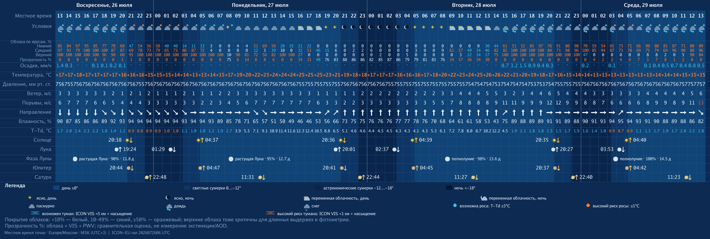
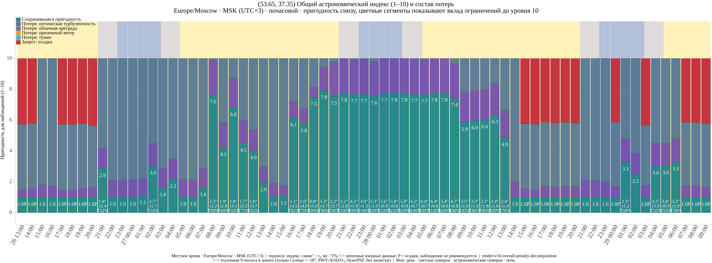
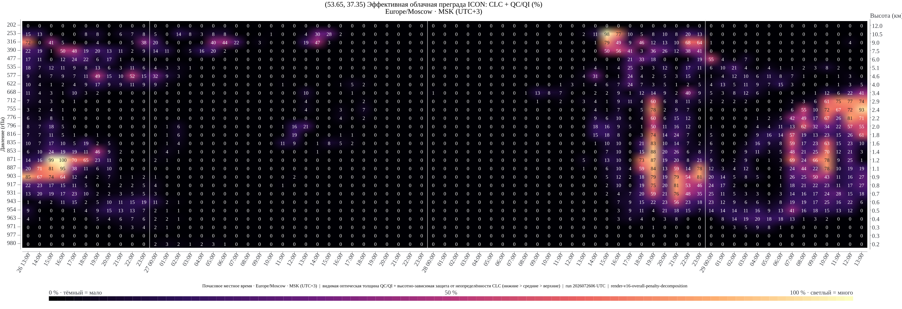
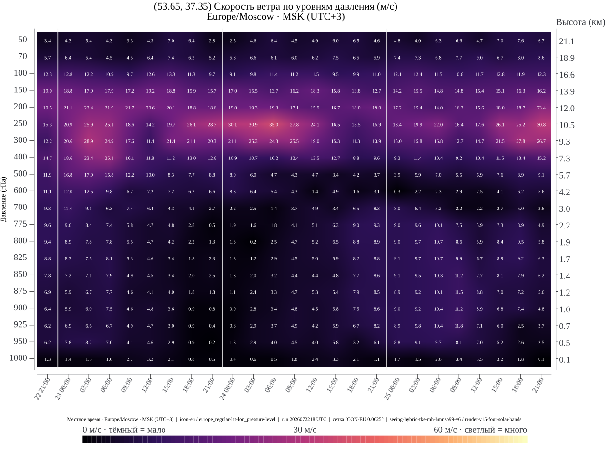
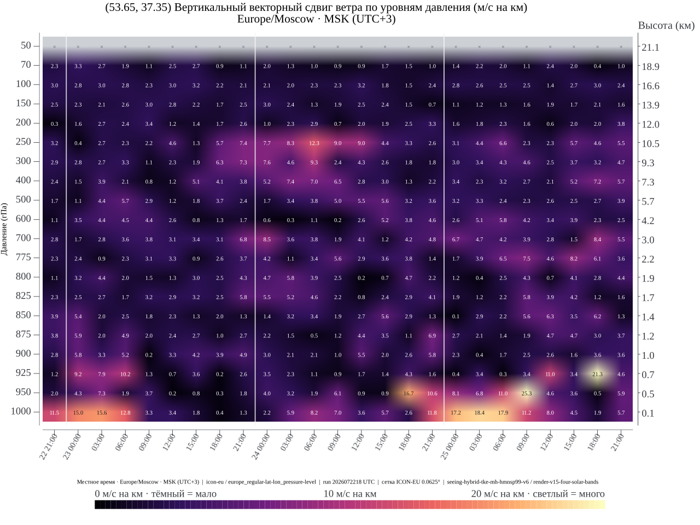
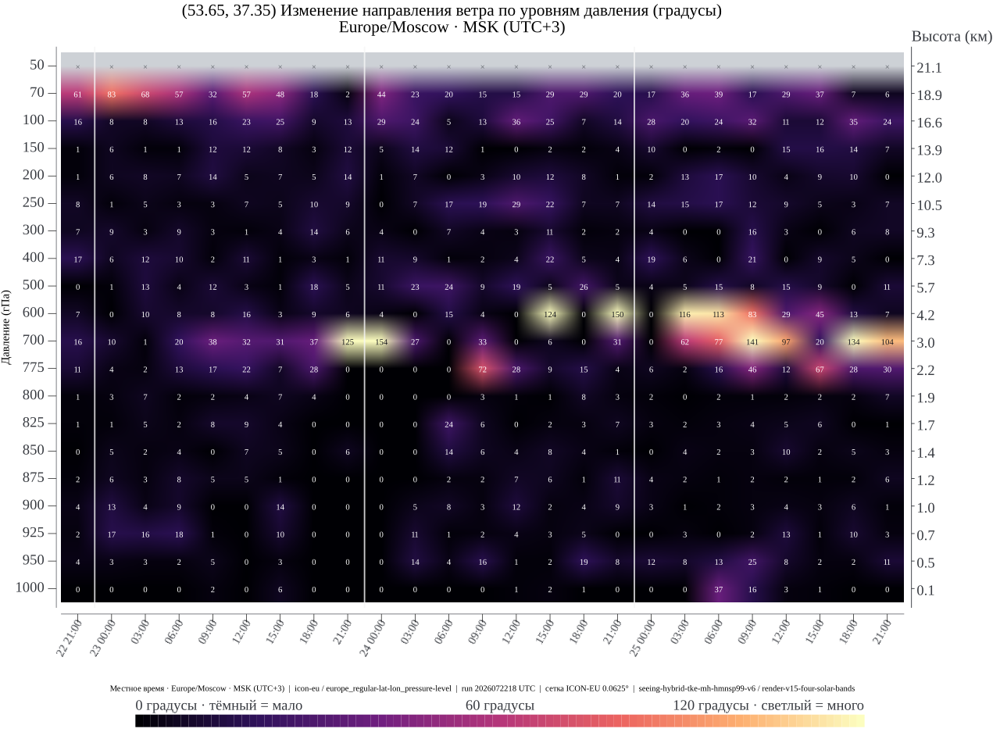
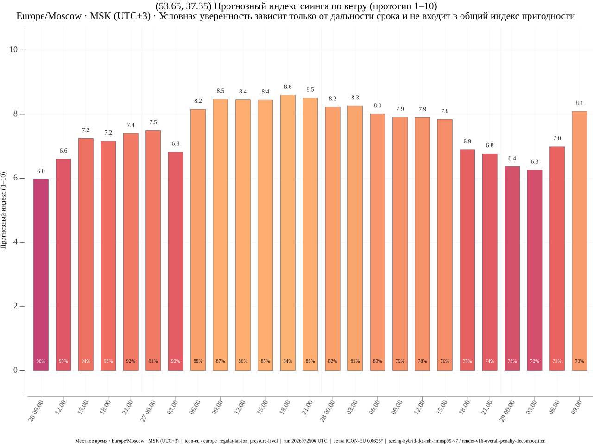
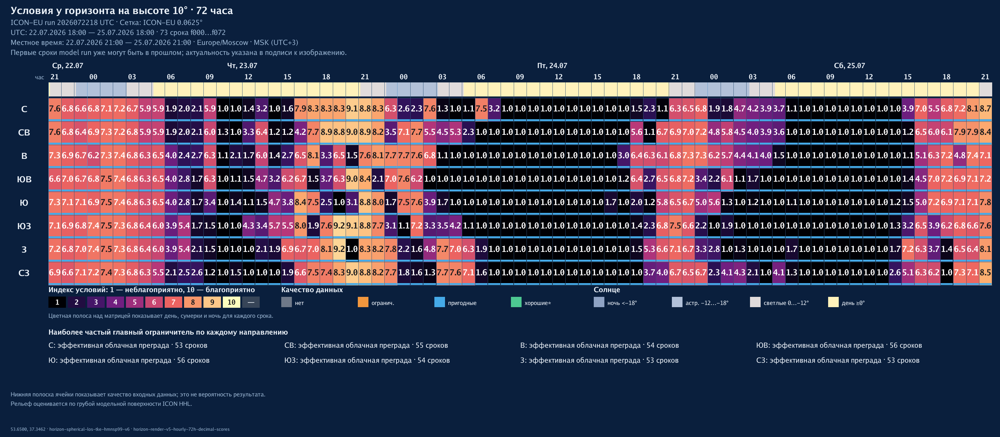

# bot_astrosferum


Научно-технический Golang-бот прогноза условий для астрономии.

**[English README](README.md)**

`bot_astrosferum` объединяет метеополя DWD ICON-EU и ICON Global, модельную оптическую турбулентность, эффективную облачную преграду, туман, диагностику ветра и эфемериды в почасовые графики для планирования. Внутри европейского домена выбирается ICON-EU, а вне него всемирное покрытие обеспечивает fallback на ICON Global. Это научное ПО, но не откалиброванный измерительный инструмент: seeing и Overall Astronomy Index остаются модельными оценками до проверки наблюдениями. Подробнее: [научный статус и воспроизводимость](docs/scientific-method.ru.md).

## Пример для Плавска

Ниже показан реальный русскоязычный результат для Плавска из цикла ICON-EU `2026072218 UTC`. Это датированный воспроизводимый пример, а не актуальный прогноз. Обложка выше является художественной иллюстрацией и не кодирует измерения.

### 1/7 · Почасовая погода и астрономические события



### 2/7 · Overall Astronomy Index



Сводная почасовая оценка помогает быстро выбрать наиболее перспективные окна: она объединяет модельный seeing, время когерентности, облачную преграду и туман. Это ориентир для планирования, а не измерение, поэтому перед выездом полезно проверить следующие диагностические графики.

### 3/7 · Эффективная облачная преграда по высоте



Карта показывает, когда и на какой высоте ожидается оптически значимая облачность. Она помогает отличить плотные нижние облака от менее мешающих верхних и оценить пригодность окна для съёмки, фотометрии или наблюдения цели на нужной высоте.

### 4/7 · Скорость ветра по давлению и высоте



Вертикальный профиль выявляет слои сильного ветра и струйное течение. Они могут ухудшать стабильность изображения и ведение, хотя одна скорость ветра не является прямым измерением seeing.

### 5/7 · Вертикальный векторный сдвиг ветра



Векторный сдвиг показывает, насколько быстро полный вектор ветра меняется на километр высоты. Яркие слои отмечают вероятные границы генерации турбулентности и часы с менее устойчивым мелкомасштабным изображением.

### 6/7 · Изменение направления ветра между соседними уровнями



График выделяет поворот ветра между соседними уровнями. Его нужно читать вместе со скоростью и векторным сдвигом: большой поворот при почти полном штиле значительно менее важен, чем при сильном потоке.

### 7/7 · Прогнозный индекс сиинга по ветру



Компактный индекс ранжирует часы только по модельному профилю ветра. Он удобен для сравнения устойчивости атмосферы, но для окончательного выбора следует использовать Overall Astronomy Index, потому что облака и туман сюда намеренно не входят.

### Горизонт · Условия по восьми направлениям на высоте 10°



Этот отдельный анализ ICON-EU сравнивает север, северо-восток, восток, юго-восток, юг, юго-запад, запад и северо-запад на всех 73 почасовых сроках. Карта даёт грубую оценку условий низко над горизонтом: учитывает облачную преграду вдоль луча, туман, рельеф модели и оптическую турбулентность, а подпись главного ограничивающего фактора объясняет плохие интервалы.

## Возможности

- принимает штатную геолокацию Telegram, geo-вложение VK, координаты текстом
  `59.9386, 30.3141` и команду `/forecast 59.9386 30.3141`;
- использует для Telegram и VK один обработчик команд, прогноза, графиков и
  хранилища; независимые long-polling supervisor позволяют второй платформе
  продолжать работу при временном сбое первой;
- хранит в PostgreSQL до 10 именованных точек пользователя;
- строит почасовой прогноз на доступную часть ближайших 72 часов в часовой
  зоне переданных координат;
- использует ICON-EU внутри его домена и последний полный ICON Global для
  любой точки мира вне домена; оба маршрута дают одинаковые семь типов
  графиков с native model-level облаками и TKE. DWD публикует Global TKE лишь
  до `+48 ч`, поэтому гибридный Overall честно заканчивается там, а погода,
  cloud obstruction и pressure-level диагностика продолжаются. В Global также
  нет прямого `VIS` для оценки тумана и proxy прозрачности;
- покрывает прогнозом весь мир: bounding box сетки ICON-EU
  `29,5…70,5° с. ш., 23,5° з. д.…62,5° в. д.` занимает примерно
  `27,4 млн км²` по сфере, включая сушу и море; ICON Global охватывает всю
  поверхность Земли — около `510,1 млн км²`, включая полюса и линию перемены
  дат, и не обрезается до территории России;
- показывает погоду, облака по ярусам, туман, риск росы, ветер, восходы и
  заходы Солнца, Луны, Юпитера и Сатурна, а также фазу Луны;
- формирует Overall Astronomy Index, карту эффективной облачной преграды и
  четыре высотных графика ветра/сиинга;
- показывает Light Pollution Atlas 2024 и отдельное сравнение с World Atlas
  2015; засветка в Overall Index не входит;
- предоставляет администраторам общее для Telegram и VK число учётных записей
  и общий график успешных и неуспешных запросов за 30 суток в MSK (UTC+3).

Бот также предоставляет опциональный анализ «Горизонт» только для ICON-EU. При
включении он появляется как действие второго этапа после обычного прогноза
ICON-EU и строит одну тепловую карту по восьми направлениям для всех 73
почасовых сроков `f000..f072` при фиксированном геометрическом угле возвышения
`10°`. Расчёт использует грубый рельеф ICON HHL, общую с Overall калибровку и
никогда не показывает кнопку и не запускает задачу для ICON Global. Текущий
цикл проверяется до тяжёлой работы, после получения данных и непосредственно
перед каждой отправкой, включая попадание в кэш. Реализованный контракт и
эксплуатационные проверки описаны в
[текущем статусе реализации](docs/implementation-status.ru.md).

`/start` и `/help` содержат краткую инструкцию и объяснение всех семи
графиков.

## Системные требования

Ниже указан профиль одного production-экземпляра с включёнными ICON-EU и
ICON Global и настройками репозитория по умолчанию. Для разработки и
синтетического `render-sample` требуется существенно меньше ресурсов.

| Ресурс | Минимум | Рекомендуется |
|---|---:|---:|
| CPU | 4 ядра x86-64 | 8–12 ядер x86-64 |
| ОЗУ | 32 GiB | 48–64 GiB |
| Свободное место на SSD | 200 GiB | от 300 GiB на NVMe |
| ПО | 64-битный Linux, Docker Engine, Docker Compose v2 | Актуальный стабильный Docker в поддерживаемом Linux-дистрибутиве |

Для сборки production-образа требуется исходящий HTTPS-доступ к GHCR, Docker
Hub, репозиториям пакетов Ubuntu и базе уязвимостей Trivy. При сборке
устанавливаются доступные обновления безопасности Ubuntu и удаляется
неиспользуемый служебный бинарник `pebble`, унаследованный от базового образа
GDAL. На время пересборки и сканирования нужно предусмотреть не менее `15 GiB`
дополнительного свободного места Docker.

Для разработки и обязательных проверок перед push используются Go `1.26.5`,
`golangci-lint 2.12.2` и `govulncheck 1.6.0`. CI дополнительно собирает
production-образ и отклоняет `CRITICAL` или `HIGH` находки Trivy; отдельный
отчёт по `MEDIUM`/`LOW` не формируется.

Стандартный бюджет point-cache в памяти равен `20 GiB`, контейнер использует
`GOMEMLIMIT=24GiB`; на сервере с меньшим объёмом ОЗУ нужно уменьшить
`app.point_cache_memory_limit`. Синхронизация моделей не начинается, если
свободного места меньше `sync.min_free_space`, по умолчанию `150 GiB`.
Дополнительный запас нужен для атомарной загрузки, двух сохраняемых model run,
PostgreSQL, point/render-cache и тайлов засветки. Требуется исходящий DNS и
HTTPS-доступ к DWD, Telegram, VK и настроенным источникам атласов; входящий
порт для long polling обеих платформ не нужен.

## Развёртывание

Production-каталог:

```text
/opt/docker/bot_astrosferum
```

Все bind-volume находятся внутри него. Модельные данные, PostgreSQL, атласы,
кеши и сгенерированные PNG располагаются в `./data` и исключены из Git.
Токены находятся в `./secrets` и также никогда не добавляются в репозиторий.

Подготовка конфигурации:

```sh
cp .env.example .env
cp config/config.example.yaml config/config.yaml
mkdir -p data secrets
chmod 700 secrets
```

В `.env` нужно задать надёжный `POSTGRES_PASSWORD`. Токены платформ хранятся
в отдельных файлах `secrets/telegram_token` и `secrets/vk_token` с
ограниченными правами; для VK также задаётся числовой `group_id` в
`config/config.yaml`:

```sh
chmod 600 secrets/telegram_token secrets/vk_token
```

В `.env` обязательна только переменная `POSTGRES_PASSWORD`; остальные
параметры управляют функциями, доступом или калибровкой и являются
необязательными. Назначение переменных окружения и YAML-полей вместе с
рекомендуемыми значениями приведено в
[полном справочнике конфигурации](docs/configuration.ru.md).

Основные команды:

```sh
cd /opt/docker/bot_astrosferum
docker compose up -d --build
docker compose ps
docker compose logs -f bot_astrosferum
docker compose run --rm bot_astrosferum doctor --config /app/config/config.yaml
docker compose run --rm bot_astrosferum sync-icon-eu --config /app/config/config.yaml
docker compose run --rm bot_astrosferum render-point --config /app/config/config.yaml --lat 59.9386 --lon 30.3141
docker compose run --rm bot_astrosferum render-horizon --config /app/config/config.yaml --lat 59.9386 --lon 30.3141 --language ru --output /app/data/verification/horizon-live.png
docker compose run --rm bot_astrosferum light-pollution --lat 55.7558 --lon 37.6173
```

`render-horizon` — команда эксплуатационной проверки. Для неё нужны
включённый анализ, полный текущий цикл ICON-EU и полностью поддерживаемая
область восьми направлений; доступность для пользователя также зависит от
включённого адаптера платформы и маршрута кнопки.

Docker Compose автоматически использует `docker-compose.yml`.

## Расчёт Overall Astronomy Index

Оптическая турбулентность объединяется в один интеграл:

- от поверхности до почасовой высоты перемешанного слоя ICON `MH`
  (`500…2000 м AGL`) используется native `T/P/TKE/HHL`;
- выше применяется HMNSP99;
- ветер учитывается в `tau0` через `Cn²·|V|^(5/3)`, а в свободной атмосфере
  также через вертикальный векторный сдвиг;
- приземный ветер даёт только мягкий практический штраф;
- роса в индекс не входит, а высокий риск тумана входит.

Физические seeing и `tau0` показываются без обрезания, но их совместный
target-agnostic utility-штраф в Overall и Horizon ограничен 25%: турбулентность
ухудшает мелкие детали, тогда как облака и туман способны скрыть объект.

Облачная оптика использует столбовые `TQC/TQI`. Высотная карта дополнительно
использует `CLC/QC/QI/T` и нативную толщину `HHL` на 27 уровнях. Защитные
коэффициенты для неразрешённой диагностической облачности равны
`45% / 24,75% / 8,1%` для нижнего, среднего и верхнего яруса. Это границы
неопределённости, а не заявленная физическая непрозрачность; более сильная
оценка по фактическому конденсату всегда имеет приоритет.

Overall `1…10` является аудируемой модельной оценкой, а не измерением DIMM и
не шкалой Пикеринга. Для абсолютной калибровки нужны наблюдения
DIMM/MASS/SCIDAR или качественные журналы наблюдений в целевых регионах.

## Данные и кеширование

- рабочий источник для Санкт-Петербурга, Москвы и других точек
  внутри домена — DWD ICON-EU;
- всемирный fallback для любой точки вне домена ICON-EU — DWD ICON Global;
- модель обновляется scheduler-ом при старте и затем каждые 15 минут;
- пользовательский запрос ничего не скачивает, а читает последний полностью
  опубликованный run;
- хранятся два последних run;
- point-cache ограничен двумя run, 512 ячейками на run и 20 GiB RAM;
- комплекты из семи PNG хранятся до 48 часов, не более 256 комплектов;
- временные файлы и устаревшие версии кешей удаляются автоматически.

Контракты ICON-EU: `surface-hourly-v17`, `cloud-hourly-v4` и
`point-v6-native-cloud-mass-mh`; ICON Global использует `cloud-hourly-v1` и
`point-v2-native-cloud`. Global bundle содержит те же 187 GRIB-сообщений/час
до `+48 ч`, затем 169: DWD прекращает TKE, продолжая все cloud и wind fields.

## Документация

- [KISS-архитектура](docs/architecture.ru.md)
- [Научная методика, формулы и воспроизводимость](docs/scientific-method.ru.md)
- [Scientific method, formulas, and reproducibility](docs/scientific-method.en.md)
- [Текущий статус реализации](docs/implementation-status.ru.md)
- [Политика обработки данных](PRIVACY.md)
- [Как внести вклад](CONTRIBUTING.md)
- [Политика безопасности](SECURITY.md)

Локальный репозиторий не содержит модельных run, runtime-кешей или секретов.
